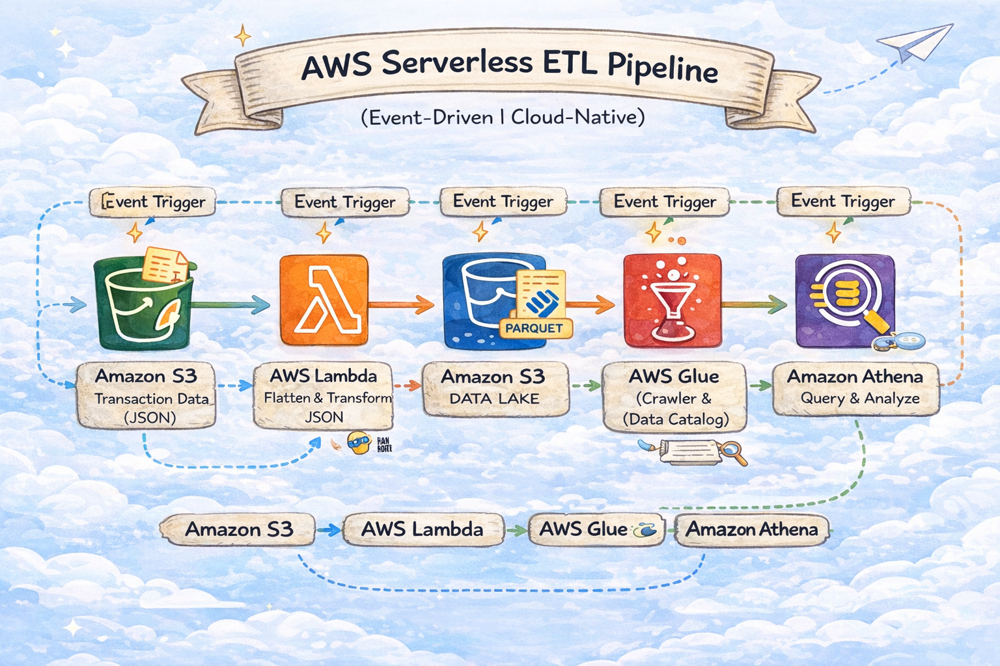

# AWS Serverless Event-Driven ETL Pipeline

An end-to-end **serverless, event-driven ETL pipeline on AWS** that transforms raw JSON data into analytics-ready Parquet files using **S3, AWS Lambda, AWS Glue, and Amazon Athena**.


## 📋 Project Overview

This project demonstrates how modern data pipelines are built using **cloud-native, serverless AWS services**.

The pipeline starts with raw transactional JSON data and automatically transforms it into a structured, query-optimized format without managing any servers.  
It follows a fully **event-driven architecture**, making it scalable, cost-efficient, and easy to extend.

## 🏗️ System Architecture


*ETL Pipeline Architecture on AWS*

## 🔄 End-to-End Data Flow

1. Raw transaction data (JSON) is uploaded to **Amazon S3**
2. **S3 Event Trigger** invokes an **AWS Lambda function**
3. Lambda:
   - Parses and flattens nested JSON data
   - Transforms the data using Python (pandas)
   - Writes optimized **Parquet files** back to S3 (Data Lake)
4. **AWS Glue Crawler** updates the Data Catalog automatically
5. Data becomes instantly queryable using **Amazon Athena**

## 🛠️ Tech Stack

- **AWS S3** – Object storage & Data Lake
- **AWS Lambda** – Serverless data transformation
- **AWS Glue (Crawler & Data Catalog)** – Schema discovery
- **Amazon Athena** – Serverless SQL analytics
- **Python** – Data transformation logic
- **Pandas & PyArrow** – Data processing & Parquet conversion
- **Boto3** – AWS SDK for Python


## 🔑 Key Features

- **Automated Data Processing**: S3 event-driven architecture triggers processing automatically
- **Data Transformation**: Flattens nested JSON structures containing orders, customers, and products
- **Scalable Design**: Built on AWS serverless technologies for automatic scaling
- **Data Normalization**: Converts hierarchical JSON into flat tabular format for easy analysis

## 🎯 Key Learnings

- Understanding **event-driven architectures** on AWS
- Building **serverless ETL pipelines** without managing servers
- Using **S3 as a Data Lake**
- Transforming and optimizing data using **Parquet**
- Automating schema discovery with **AWS Glue Crawlers**
- Performing analytics using **Athena (serverless SQL)**

## 📁 Project Structure

```
AWS-ServerLess-ETL-Pipeline/
├── flatten_data.ipynb       # Data transformation logic and testing
├── orders_etl.json          # Sample order data
├── .venv/                   # Python virtual environment
└── README.md               # Project documentation
```

## 🚀 Getting Started

### Prerequisites

- Python 3.x installed
- Virtual environment support
- AWS account (for deployment)

### Local Setup

1. **Clone the repository**
   ```bash
   cd Project-5-DE-AWS
   ```

2. **Activate virtual environment**
   ```powershell
   .\.venv\Scripts\Activate.ps1
   ```

3. **Install dependencies**
   ```bash
   pip install pandas
   pip install ipykernel
   ```

4. **Run the notebook**
   - Open `flatten_data.ipynb` in Jupyter/VS Code
   - Execute cells to test the transformation logic


## 📈 Future Enhancements

- [ ] Add error handling and data validation
- [ ] Implement data quality checks
- [ ] Add support for incremental processing
- [ ] Create automated tests
- [ ] Add logging and monitoring
- [ ] Store processed data in AWS Redshift/RDS
- [ ] Create data visualization dashboard

## 👤 Author

Meet Patel


- **Created**: January 2026
- **Last Updated**: January 24, 2026

## 📄 License

This project is created for educational and portfolio purposes.

---
